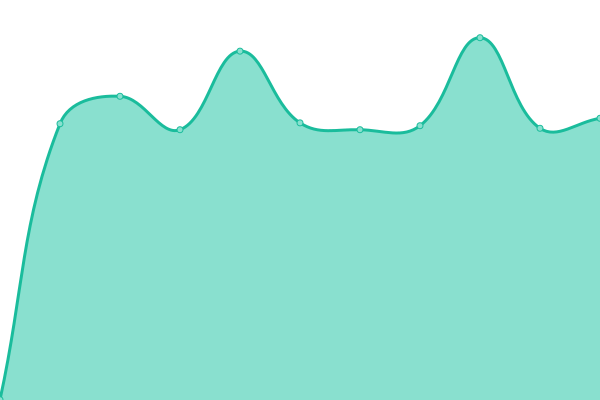
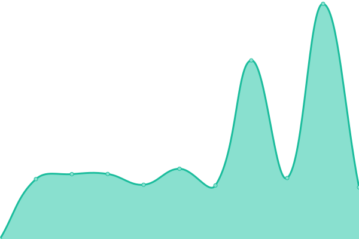

# [📈 Live Status](https://ivankopcik.github.io/upptime): <!--live status--> **🟨 Partial outage**

This repository contains the open-source uptime monitor and status page for [Ivan Kopcik](http://www.twitter.com/ivankopcik), powered by [Upptime](https://github.com/upptime/upptime).

With [Upptime](https://upptime.js.org), you can get your own unlimited and free uptime monitor and status page, powered entirely by a GitHub repository. We use [Issues](https://github.com/ivankopcik/upptime/issues) as incident reports, [Actions](https://github.com/ivankopcik/upptime/actions) as uptime monitors, and [Pages](https://ivankopcik.github.io/upptime) for the status page.

<!--start: status pages-->
<!-- This summary is generated by Upptime (https://github.com/upptime/upptime) -->
<!-- Do not edit this manually, your changes will be overwritten -->

| URL                                                | Status  | History                                                                                                         | Response Time                                                                           | Uptime                                                                                                                                                                                                                                           |
| -------------------------------------------------- | ------- | --------------------------------------------------------------------------------------------------------------- | --------------------------------------------------------------------------------------- | ------------------------------------------------------------------------------------------------------------------------------------------------------------------------------------------------------------------------------------------------ |
| [mobilonline.sk](https://www.mobilonline.sk)       | 🟩 Up   | [mobilonline-sk.yml](https://github.com/ForBestClients/upptime/commits/master/history/mobilonline-sk.yml)       |  1465ms    |        |
| [lab.online](https://lab.online)                   | 🟩 Up   | [lab-online.yml](https://github.com/ForBestClients/upptime/commits/master/history/lab-online.yml)               |  1322ms        |                |
| [freshbox.sk](https://www.freshbox.sk)             | 🟩 Up   | [freshbox-sk.yml](https://github.com/ForBestClients/upptime/commits/master/history/freshbox-sk.yml)             |  968ms        |              |
| [murat.sk](https://www.murat.sk)                   | 🟥 Down | [murat-sk.yml](https://github.com/ForBestClients/upptime/commits/master/history/murat-sk.yml)                   |  5783ms          |                     |
| [bezeckepotreby.sk](https://www.bezeckepotreby.sk) | 🟩 Up   | [bezeckepotreby-sk.yml](https://github.com/ForBestClients/upptime/commits/master/history/bezeckepotreby-sk.yml) |  1294ms |  |

<!--end: status pages-->

[**Visit our status website →**](https://ivankopcik.github.io/upptime)

## 📄 License

- Code: [MIT](./LICENSE) © [Ivan Kopcik](http://www.twitter.com/ivankopcik)
- Data in the `./history` directory: [Open Database License](https://opendatacommons.org/licenses/odbl/1-0/)
