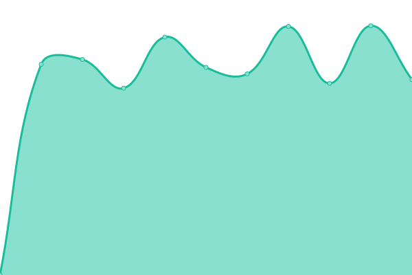

# [📈 Live Status](https://ivankopcik.github.io/upptime): <!--live status--> **🟨 Partial outage**

This repository contains the open-source uptime monitor and status page for [Ivan Kopcik](http://www.twitter.com/ivankopcik), powered by [Upptime](https://github.com/upptime/upptime).

With [Upptime](https://upptime.js.org), you can get your own unlimited and free uptime monitor and status page, powered entirely by a GitHub repository. We use [Issues](https://github.com/ivankopcik/upptime/issues) as incident reports, [Actions](https://github.com/ivankopcik/upptime/actions) as uptime monitors, and [Pages](https://ivankopcik.github.io/upptime) for the status page.

<!--start: status pages-->
<!-- This summary is generated by Upptime (https://github.com/upptime/upptime) -->
<!-- Do not edit this manually, your changes will be overwritten -->

| URL                                       | Status  | History                                                                                             | Response Time                                                                     | Uptime                                                                                                                                                                                                                           |
| ----------------------------------------- | ------- | --------------------------------------------------------------------------------------------------- | --------------------------------------------------------------------------------- | -------------------------------------------------------------------------------------------------------------------------------------------------------------------------------------------------------------------------------- |
| [Mobilonline](https://www.mobilonline.sk) | 🟩 Up   | [mobilonline.yml](https://github.com/ForBestClients/upptime/commits/master/history/mobilonline.yml) |  1819ms |  |
| [Lab Online](https://lab.online)          | 🟩 Up   | [lab-online.yml](https://github.com/ForBestClients/upptime/commits/master/history/lab-online.yml)   |  1411ms  |    |
| [FreshBox](https://www.freshbox.sk)       | 🟩 Up   | [fresh-box.yml](https://github.com/ForBestClients/upptime/commits/master/history/fresh-box.yml)     |  1383ms   |      |
| Secret Site                               | 🟥 Down | [secret-site.yml](https://github.com/ForBestClients/upptime/commits/master/history/secret-site.yml) |  0ms    |  |

<!--end: status pages-->

[**Visit our status website →**](https://ivankopcik.github.io/upptime)

## 📄 License

- Code: [MIT](./LICENSE) © [Ivan Kopcik](http://www.twitter.com/ivankopcik)
- Data in the `./history` directory: [Open Database License](https://opendatacommons.org/licenses/odbl/1-0/)
