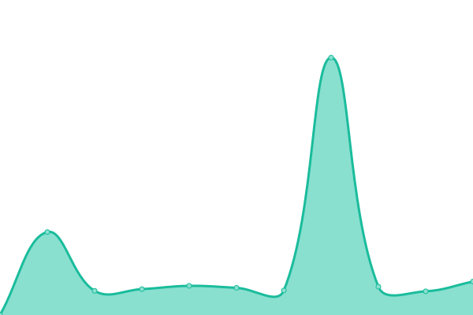
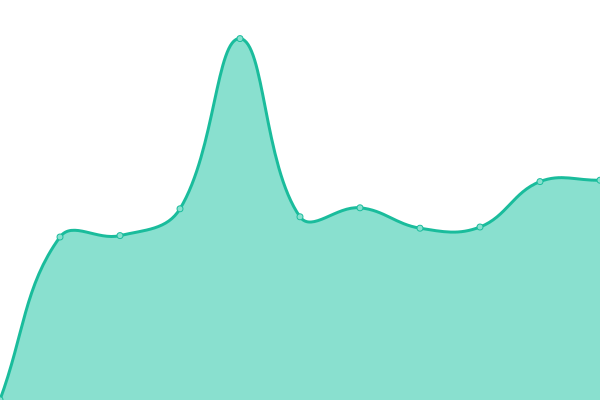

# [📈 Live Status](https://ivankopcik.github.io/upptime): <!--live status--> **🟩 All systems operational**

This repository contains the open-source uptime monitor and status page for [Ivan Kopcik](http://www.twitter.com/ivankopcik), powered by [Upptime](https://github.com/upptime/upptime).

With [Upptime](https://upptime.js.org), you can get your own unlimited and free uptime monitor and status page, powered entirely by a GitHub repository. We use [Issues](https://github.com/ivankopcik/upptime/issues) as incident reports, [Actions](https://github.com/ivankopcik/upptime/actions) as uptime monitors, and [Pages](https://ivankopcik.github.io/upptime) for the status page.

<!--start: status pages-->
<!-- This summary is generated by Upptime (https://github.com/upptime/upptime) -->
<!-- Do not edit this manually, your changes will be overwritten -->
<!-- prettier-ignore -->
| URL | Status | History | Response Time | Uptime |
| --- | ------ | ------- | ------------- | ------ |
| [mobilonline.sk](https://www.mobilonline.sk) | 🟩 Up | [mobilonline-sk.yml](https://github.com/ForBestClients/upptime/commits/master/history/mobilonline-sk.yml) | 

 1531ms
     
 | 

   

| [lab.online](https://lab.online) | 🟩 Up | [lab-online.yml](https://github.com/ForBestClients/upptime/commits/master/history/lab-online.yml) | 

 1263ms
     
 | 

   

| [freshbox.sk](https://www.freshbox.sk) | 🟩 Up | [freshbox-sk.yml](https://github.com/ForBestClients/upptime/commits/master/history/freshbox-sk.yml) | 

 1033ms
     
 | 

   

| [murat.sk](https://www.murat.sk) | 🟩 Up | [murat-sk.yml](https://github.com/ForBestClients/upptime/commits/master/history/murat-sk.yml) | 

 3869ms
     
 | 

   

| [bezeckepotreby.sk](https://www.bezeckepotreby.sk) | 🟩 Up | [bezeckepotreby-sk.yml](https://github.com/ForBestClients/upptime/commits/master/history/bezeckepotreby-sk.yml) | 

 1051ms
     
 | 

   

<!--end: status pages-->

[**Visit our status website →**](https://ivankopcik.github.io/upptime)

## 📄 License

- Code: [MIT](./LICENSE) © [Ivan Kopcik](http://www.twitter.com/ivankopcik)
- Data in the `./history` directory: [Open Database License](https://opendatacommons.org/licenses/odbl/1-0/)
